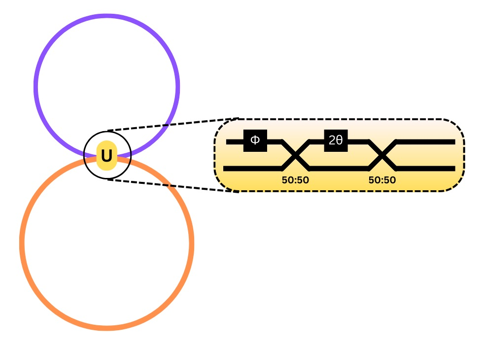
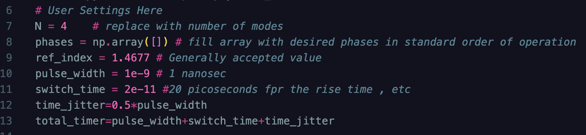
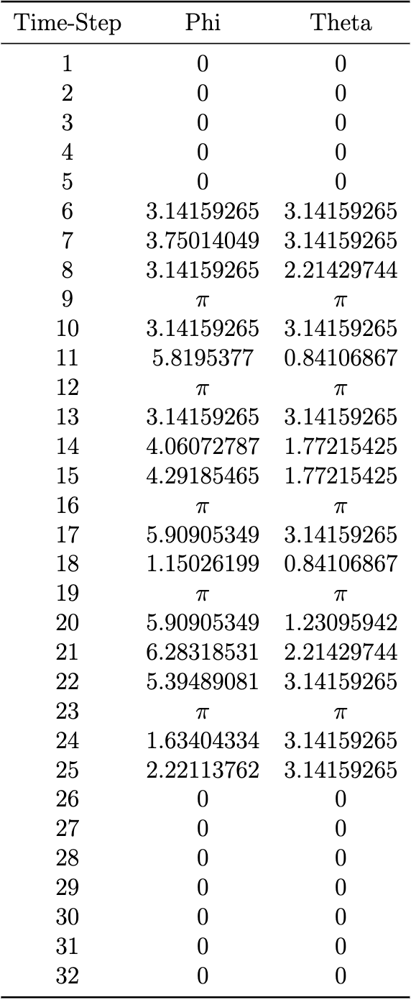

<h1>Loop Architecture</h1>
The loop architecture is composed of 2 fibre optic cable loops, forming a figure eight with an MZI conencting both loops, as illustrated below.

The top loop is composed by  $$\frac{N}{2}\tau$$  time-bins, while the bottom is composed by $$(\frac{N}{2}+1)\tau$$ time-bins. 

The necessary fibre optic cable for each of the loops is dependant on mesh size, as well as the time-bin length. The necessary lengths for the top loop and bottom loop are determined in the algorithm. Only one MZI is necessary in the system; it connects the top and bottom loops together and performs all of the transformations on each mode as they pass through it. 

The MZI also functions as a switch, as modes need to couple to different loops at different times in order for the modes to interfere with each other at the correct times.   

<h1 class="h1"> User Input </h1>

The algorithm is capable of taking in different user inputs such as the index of refraction of the cable, the switch time for the interferometer / EOM being used, the desired size mesh and the phase shifts one wishes to apply to the system. The only condition is that the mesh be an even mesh (N x N) and that the phases be in order of time interference. The order of interference is shown in the Example section of this documentation. The first modes to interfere are always modes 1 and 2 followed by 3 and 4, then 5 and 6, etc. 

An image of the code showing where the user settings are applied can be seen below. This is found at the very start, after all necessary libraries are imported.

Here, the user imputs the N mesh size and the array of desired phase shifts in order of application. The user can also set the refractive index (which is currently set based on accepted values), the pulse width in seconds, the switch rise time in seconds (this is set as an accepted value, but may be changed based on the equipment used) and the desired time jitter. In the image, the time jitter is considered to be half of the pulse width. The total time bin is then calculated as the pulse width plus the switch rise time and the time jitter. 

<h1 class="h1"> Script Output </h1>

The script is made to tell the user when to apply pi phase shifts so the necessary transformations can take place, so a handy table showing the time step and the phase transformation is printed. As an example, the necessary phases to apply a CNOT gate are shown below**:

The pi symbols denote switches occuring between modes where no mathematical transformation is being applied, only the one to switch the modes between loops.

**Note that the final phase shifts needed are not shown in this step, as these are added at the very end as the last transformation on each mode.