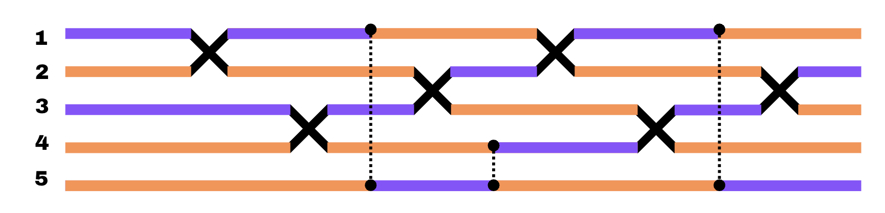
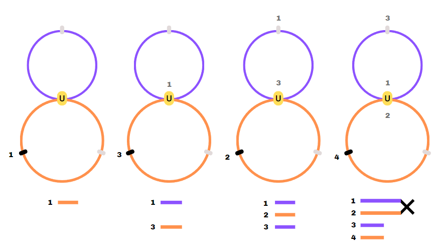
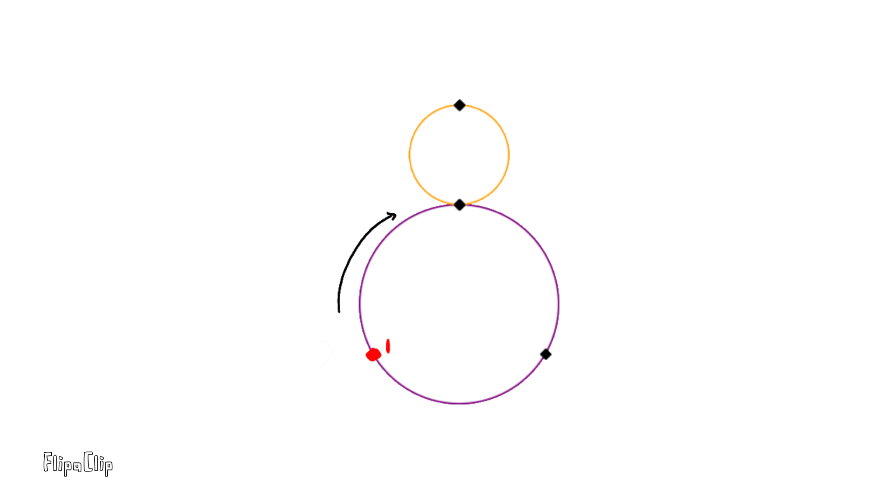
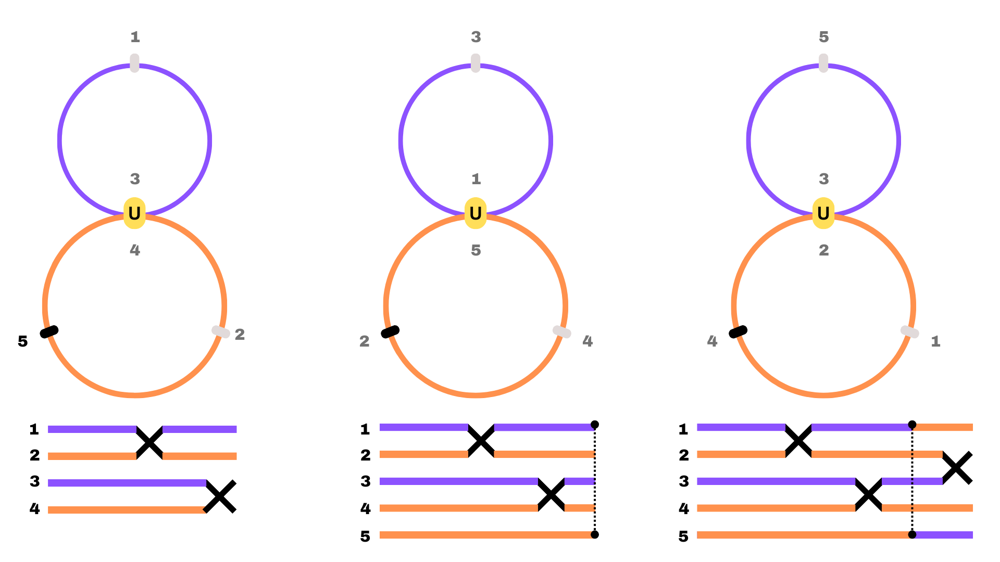
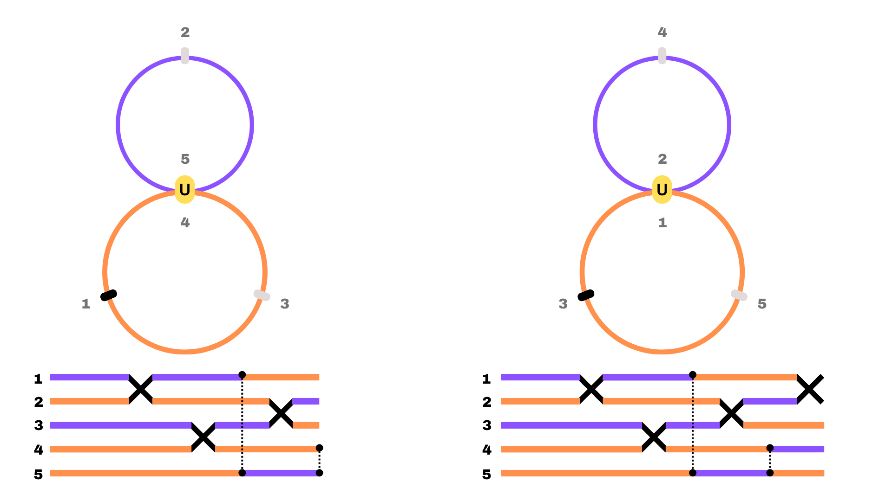
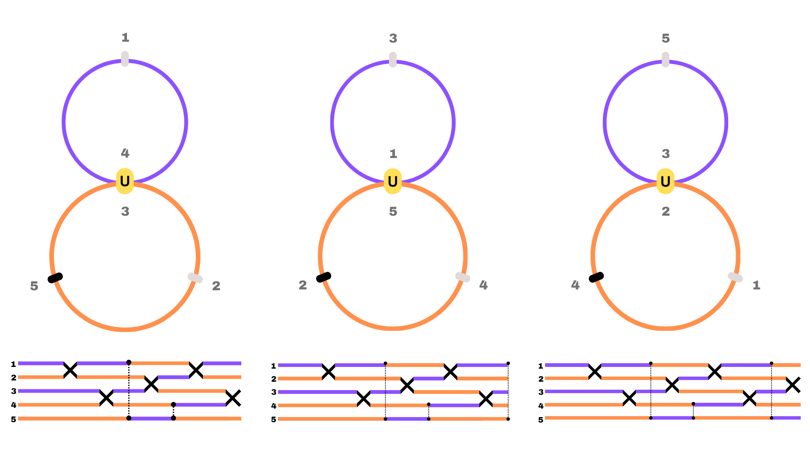

An example for a 4 x 4 mesh is outlined in this section with appropriate images to go along with each step. 

The modes added into the system enter odd modes first, followed by the even modes and lastly, and ancillary (void) mode. If we were to write these in an array it would take ethe follwoign form: [1,3,2,4,5] where the numbers are the mode numbers for the 4 x 4 and the 5th mode is the ancillaty mode. Spatially, this mesh would look like the one below, with the modes appropriately numbered.

The sequence to create a 4 x 4 mesh begins by inserting the first mode into the system, in the next time-bin mode 3 is added and the first mode is coupled into the top loop.  Next, the second mode is added while the third mode is coupled to the top loop and the first mode "moves" to the next time-bin in the top loop. 
In the following time step, the fourth mode is added to the system and modes 1 and 2 interfere with each other while the third mode moves to the next position within the top loop.

These first four time-steps are illustrated in the figure below, with the modes numbered accordingly, and the spatial mesh at each step is shown below the corresponding loop-architecture. Each loop diagram depicts the position of each mode within the system, the modes are inserted in the black notch, while the grey notches represent the positions each pulse would occupy at different time-bins. The yellow notch labeled with a U is representative of both a time-bin position and the MZI. The spatial mesh colours match the colours of the top and bottom loops to better depict the mode's position within the loop system. 

  
*
 At this stage, all the pulses have been coupled into the system and no other pulses will be added.
*

The next time-bin introduces an ancillary mode. This mode is a void mode and not an actual pulse, and it will serve to switch modes between loops in the system. At the same time, the third and fourth modes interfere, while the first mode moves back into the top loop and the second mode continues in the bottom loop. To better illustrate the addition of modes into the system, a gif has been made (in flippa clip) shown below:

The first switch in the system occurs in the next time step, here the first mode meets the fifth (ancillary) mode, and it is coupled to the bottom loop by applying a phase shift of pi. The switch is denoted by the dashed line that connects the first mode and fifth mode in the spatial mesh. At this stage, the third mode is found in the top loop, while the second and fourth modes are in the bottom loop. In the next step, modes 3 and 2 interfere, mode 1 and 4 are found in the bottom loop while mode 5 is in the top. An extra pi shift is added to couple the third mode to the bottom loop and the second mode to the top loop in the next time-step. 

Continuing the pattern, modes 5 and 4 meet which corresponds to another pi shift, coupling the fourth mode to the top and the fifth mode to the bottom loop. Modes 1 and 3 are found within the bottom loop, and mode 2 in the top. In the next step, modes 2 and 1 interfere and a pi shift is added to couple them to the opposite loops. Modes 3 and 5 are found in the bottom loop and mode 4 is in the top. 

In the next time-step, modes 4 and 3 interfere, modes 5 and 2 are found in the bottom loop and mode 1 is in the top. Next, Modes 1 and 5 interfere, corresponding to a switch. The even modes are found in the bottom loop, while mode 3 is in the top. 

Finally, in the next step, modes 3 and 2 interfere, while modes 1 and 4 are found in the bottom loop and mode 5 is in the top. These last three steps are illustrated in the figure below. This marks the end of the 4 x 4 mesh scheme, and the modes can be uncoupled by allowing them to exit the loops by the same notch that coupled them at the start. 

This same pattern can be followed to create any size of N x N MZI mesh, provided that the number of modes is even and that the mesh in question is in the Clements configuration!

The algorithm will then output the necessary phase shifts, this is shown in the picture below: